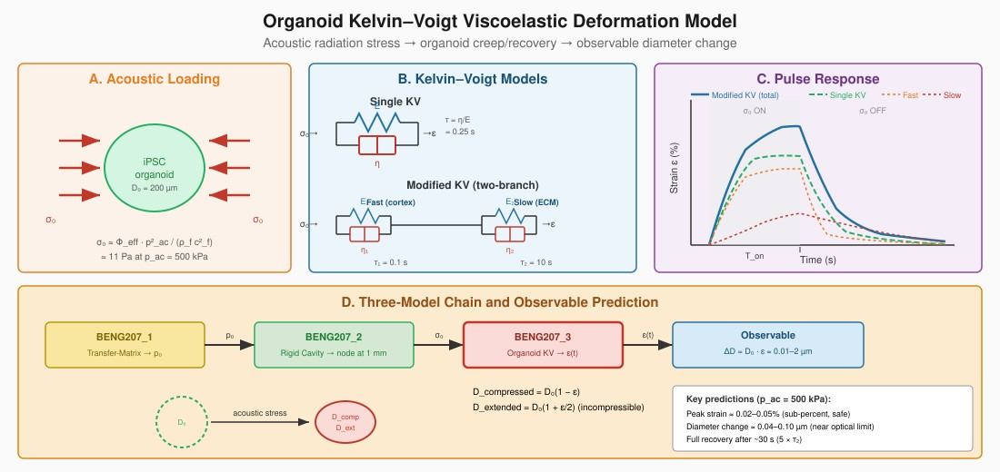

<pre>
Title: BENG207_Organoid_KV_Model
Author: BENG207 students (Instructor: Akihiro J. Matsuoka, M.D., D.M.Sc., Ph.D., FACS, Co-instructor: James Friend, Ph.D.)
Course: BENG207 Winter/Spring Semester (2026)
Status: Draft
Type: Analytical model
License: Public domain
Further discussion: TBD
</pre>

Instruction to BENG207 students: Please review all of the variables/parameters.
Please read GitHub upload insturction before you upload your code.

---

## Documentation

- [Student GitHub Workflow](GitHub_Upload_Instruction_BENG207.md)

## Table of Contents

* [Abstract](#abstract)
* [Background and Significance](#background-and-significance)
* [Deliverable](#deliverable)
* [BENG207 Organoid KV Model](#beng207-organoid-kv-model-analytical-model)
* [Parameters](#parameters)
* [Output Figures: Captions](#output-figures-captions)
* [References](#references)

---

## Abstract

TBW

## Background and Significance

### Why Model Organoid Deformation?

The BENG207_1 transfer-matrix model describes how acoustic energy enters the fluid channel through the vertical stack. The BENG207_2 rigid cavity resonator model describes how that energy is organized into a lateral standing wave with pressure nodes at ~1 mm spacing, where iPSC organoids form. However, neither model addresses what happens to the organoid *itself* once it is trapped at a pressure node.

An organoid sitting at a pressure node experiences a time-varying acoustic radiation stress. Unlike a rigid bead, the organoid is a soft, viscoelastic biological structure — it deforms under this stress. The deformation has practical consequences for the biohybrid cochlear implant:

* **Too much deformation** may disrupt cell-cell junctions, collapse internal lumens, or trigger mechanotransduction pathways that alter differentiation — potentially converting neural progenitors into unintended cell types.
* **Too little deformation** may indicate the acoustic field is not coupling efficiently to the organoid, or that the organoid has stiffened pathologically (e.g., fibrosis).
* **Residual (non-recovered) deformation** after repeated acoustic pulses may indicate permanent structural damage or plastic remodeling of the extracellular matrix (ECM).

This model provides the quantitative framework to predict organoid deformation as a function of acoustic parameters (pressure amplitude, pulse duration, duty cycle) and organoid mechanical properties (elastic modulus, viscosity, relaxation times). It answers the design question: **for a given acoustic protocol, how much does the organoid deform, and does it fully recover?**

### The Kelvin-Voigt Viscoelastic Framework

Biological tissues are viscoelastic — they exhibit both elastic (spring-like, instantaneous) and viscous (dashpot-like, time-dependent) behavior. The simplest model that captures both is the Kelvin-Voigt (KV) element: a spring (modulus E) in parallel with a dashpot (viscosity η). Under a step stress σ₀, the KV element produces a creep response:

$$
\varepsilon(t) = \frac{\sigma_0}{E}\left(1 - e^{-t/\tau}\right), \quad \tau = \frac{\eta}{E}
$$

where τ is the **relaxation time** — the characteristic timescale for the organoid to approach its equilibrium deformation. When the stress is removed, the strain recovers exponentially with the same time constant:

$$
\varepsilon(t) = \varepsilon_T \, e^{-(t-T)/\tau}
$$

where ε_T is the strain at the moment the stress was removed (t = T). This complete recovery is a defining feature of the KV model — it predicts **no permanent deformation**, only delayed elastic response.

### Single KV vs. Modified (Two-Branch) KV

A single KV element has one relaxation time τ. Real organoids, however, exhibit at least two distinct deformation timescales:

1. **Fast response (τ₁ ~ 0.1 s):** This reflects the deformation of individual cells — cortical actin, cell membrane bending, and cytoplasmic flow. When you poke a single cell with an AFM tip, it deforms within ~100 ms.
2. **Slow response (τ₂ ~ 10 s):** This reflects the rearrangement of cells relative to each other and the remodeling of the extracellular matrix. The organoid as a multicellular structure takes much longer to reach mechanical equilibrium than a single cell.

The modified KV model places two KV elements in series (technically, the stress is shared and strains add):

$$
\varepsilon(t) = \frac{\sigma_0}{E_1}\left(1 - e^{-t/\tau_1}\right) + \frac{\sigma_0}{E_2}\left(1 - e^{-t/\tau_2}\right)
$$

The fast branch (E₁ = 500 Pa, τ₁ = 0.1 s) captures the initial rapid deformation. The slow branch (E₂ = 30 Pa, τ₂ = 10 s) captures the continued creep that occurs over seconds to tens of seconds. The slow branch is softer (lower E₂) because intercellular rearrangement offers less resistance than intracellular deformation.

This two-timescale behavior has practical consequences for acoustic pulse design:

* **Short pulses (T_on < τ₁):** Only the fast branch responds. The organoid barely deforms.
* **Moderate pulses (τ₁ < T_on < τ₂):** The fast branch is fully loaded; the slow branch is partially loaded. Most of the deformation comes from the fast branch.
* **Long pulses (T_on > τ₂):** Both branches reach equilibrium. Maximum deformation occurs.

### Acoustic Stress Estimation

The organoid at 20 MHz has D/λ ≈ 2.7 (diameter = 200 µm, λ ≈ 74 µm), so it is **not in the small-particle regime**. The Gor'kov point-particle theory (used in BENG207_2 for positioning) does not strictly apply for computing the deformation stress — the acoustic field varies across the organoid diameter. Instead, we estimate the effective uniaxial compressive stress from the acoustic radiation pressure:

$$
\sigma_0 \approx 2 \, \Phi_{\mathrm{eff}} \, E_{\mathrm{ac}} = \Phi_{\mathrm{eff}} \, \frac{p_{\mathrm{ac}}^2}{\rho_f \, c_f^2}
$$

where E_ac = p_ac²/(2ρ_f c_f²) is the acoustic energy density and Φ_eff ≈ 0.15 is an effective contrast/geometric factor. For p_ac = 500 kPa (a moderate SAW-driven pressure), this gives σ₀ ≈ 11 Pa. This is small compared to E₁ = 500 Pa, meaning the resulting strains are small (sub-percent), which is the linear viscoelastic regime where the KV model is valid.

**Note on frequency:** The code currently uses f₀ = 20 MHz for the D/λ calculation and stress estimation. The actual operating frequency for organoid positioning is ~741 kHz (BENG207_2). At 741 kHz, D/λ ≈ 0.1, and the organoid is well within the small-particle regime. The 20 MHz frequency may be relevant if the system uses a high-frequency transducer for a different purpose (e.g., characterization), or the students can change f₀ to 741 kHz. The KV deformation physics is independent of frequency — it depends only on the applied stress magnitude and pulse timing, not on the frequency of the carrier wave.

### Relationship to BENG207_1 and BENG207_2

The three models form a complete chain:

1. **BENG207_1 (Transfer-Matrix):** Determines the acoustic pressure amplitude p₀ entering the fluid channel as a function of frequency and layer geometry. This sets the available acoustic energy.
2. **BENG207_2 (Rigid Cavity Resonator):** Determines where organoids form (pressure nodes at ~1 mm spacing) and the Gor'kov trapping force that holds them in place. Uses p₀ from BENG207_1.
3. **BENG207_3 (This model — Organoid KV):** Determines how much each organoid deforms under the acoustic radiation stress derived from p₀. Predicts whether the deformation is safe (reversible, sub-percent strain) or damaging (large strain, incomplete recovery).

The coupling between models is through the acoustic pressure: BENG207_1 → p₀ → BENG207_2 (lateral force) and BENG207_3 (deformation stress σ₀). If the transfer-matrix model predicts that couplant degradation reduces p₀ by 3 dB, both the trapping force (BENG207_2) and the organoid deformation (BENG207_3) drop by 50%.

### Pulse Train Response and Residual Strain

In practice, the acoustic field is not applied as a single continuous pulse but as a sequence of ON/OFF cycles (pulse train). This model computes the organoid strain under arbitrary pulse protocols using superposition of shifted single-pulse responses.

The key question is whether **residual strain accumulates** across pulses. For a single KV element, the answer is no — each pulse's strain fully decays before the next pulse (provided T_off > 5τ). For the two-branch modified KV, the slow branch (τ₂ = 10 s) may not fully recover between pulses if T_off is short (e.g., 2 s). This leads to a ratcheting effect where each successive pulse adds a small increment of persistent deformation. This is not permanent damage — the strain will eventually recover after the last pulse — but it means the organoid is continuously deformed during the acoustic protocol, which may affect cellular behavior.

### Experimental Validation

The model predictions are directly testable using existing technology:

* **Creep-recovery curves:** Apply a known acoustic pulse and image the organoid diameter change over time using high-speed brightfield microscopy. Fit the creep and recovery curves to extract E₁, η₁, E₂, η₂.
* **Pulse protocol dependence:** Compare short-pulse vs. long-pulse responses. The single KV model predicts a single exponential approach to equilibrium; the two-branch model predicts a distinct two-phase response with fast initial deformation followed by slow creep.
* **Acoustic pressure sweep:** Measure peak deformation vs. transducer voltage. The model predicts a linear relationship (strain ∝ σ₀ ∝ p_ac²) in the small-deformation regime.
* **Residual strain after pulse train:** Image the organoid after the last pulse in a train. The two-branch model predicts measurable residual strain if T_off < 5τ₂ ≈ 50 s.

Predicted diameter changes at p_ac = 500 kPa are on the order of 0.01–0.1 µm (sub-percent strain), which is near the resolution limit of optical microscopy (~0.3 µm diffraction limit). Measurement may require phase-contrast imaging, digital holographic microscopy, or higher acoustic pressures. At p_ac = 2 MPa, diameter changes approach ~1 µm and become optically resolvable.

## Deliverable

Here we compute the viscoelastic deformation ε(t) of a 200 µm iPSC organoid under pulsed acoustic loading, using both single and two-branch Kelvin-Voigt models. We characterize:

1. Single-pulse creep and recovery response for both models.
2. Pulse train strain accumulation for repeated ON/OFF cycles.
3. Peak deformation as a function of pulse duration (10 ms to 10 s).
4. Parameter sensitivity: how E₁, E₂, τ₁, τ₂ affect peak and residual strain.
5. Pulse protocol comparison: short, long, and burst protocols.
6. Diameter change prediction: conversion from strain to observable µm change.
7. Acoustic pressure sweep: peak deformation vs. p_ac from 10 kPa to 3 MPa.

## BENG207 Organoid KV Model (Analytical Model)

### Single Kelvin-Voigt Element

The constitutive equation is:

$$
\sigma(t) = E \, \varepsilon(t) + \eta \, \dot{\varepsilon}(t)
$$

For a step stress σ₀ applied at t = 0 and removed at t = T:

$$
\varepsilon(t) = \begin{cases}
\frac{\sigma_0}{E}\left(1 - e^{-t/\tau}\right) & 0 \leq t < T \\
\varepsilon(T) \, e^{-(t-T)/\tau} & t \geq T
\end{cases}
$$

where τ = η/E is the relaxation time.

### Modified KV (Two-Branch)

Two KV elements in parallel (strains add, stress shared equally):

$$
\varepsilon(t) = \frac{\sigma_0}{E_1}\left(1 - e^{-t/\tau_1}\right) + \frac{\sigma_0}{E_2}\left(1 - e^{-t/\tau_2}\right)
$$

where τ₁ = η₁/E₁ (fast, cortex/cell) and τ₂ = η₂/E₂ (slow, ECM/intercellular).

### Pulse Train (Superposition)

For N pulses with period T_on + T_off, the total strain is the superposition of shifted single-pulse responses:

$$
\varepsilon_{\mathrm{total}}(t) = \sum_{n=0}^{N-1} \varepsilon_{\mathrm{pulse}}\left(t - n(T_{\mathrm{on}} + T_{\mathrm{off}})\right)
$$

where each ε_pulse is the single-pulse response (creep during ON, recovery during OFF).

### Acoustic Stress

$$
\sigma_0 \approx \Phi_{\mathrm{eff}} \, \frac{p_{\mathrm{ac}}^2}{\rho_f \, c_f^2}, \quad \Phi_{\mathrm{eff}} \approx 0.15
$$

### Diameter Change

Assuming the organoid is approximately incompressible (Poisson's ratio ν ≈ 0.5), uniaxial compression along the acoustic axis produces transverse extension:

$$
D_{\mathrm{compressed}} = D_0 (1 - \varepsilon), \quad D_{\mathrm{extended}} = D_0 (1 + \varepsilon/2)
$$

### Figure

If you want to modify this figure, a vector version can be found in docs/img.

**Figure 1: Schematic overview of the BENG207_3 organoid Kelvin–Voigt viscoelastic deformation model.**

**(A) Acoustic Loading.** A 200\;\mu\text{m} diameter iPSC-derived organoid (green ellipse) sits at a pressure node of the lateral standing wave established by the rigid cavity resonator (BENG207_2). The acoustic radiation stress \sigma_0 acts as a uniaxial compressive load from both sides (red arrows), squeezing the organoid along the wave propagation axis. The stress magnitude is estimated from the acoustic energy density and an effective contrast factor:

$$
\sigma_0 \approx \Phi_{\mathrm{eff}} \cdot \frac{p_{\mathrm{ac}}^2}{\rho_f \, c_f^2}
$$

where \Phi_{\mathrm{eff}} \approx 0.15 accounts for both the acoustic contrast of the organoid relative to water and the geometric correction for a particle that is not small compared to the wavelength (D/\lambda \approx 2.7 at 20\;\text{MHz}). At a moderate acoustic pressure of p_{\mathrm{ac}} = 500\;\text{kPa}, the estimated stress is \sigma_0 \approx 11\;\text{Pa} — well within the linear viscoelastic regime for soft biological tissue.

**(B) Kelvin–Voigt Models.** *Top:* The single KV element consists of a spring (elastic modulus E = 200\;\text{Pa}) in parallel with a dashpot (viscosity \eta = 50\;\text{Pa}\!\cdot\!\text{s}), giving a single relaxation time \tau = \eta/E = 0.25\;\text{s}. Under a step stress \sigma_0, the strain rises as

$$
\varepsilon(t) = \frac{\sigma_0}{E}\left(1 - e^{-t/\tau}\right)
$$

and recovers fully upon stress removal. This model captures the gross creep-recovery behavior but cannot distinguish between intracellular and intercellular deformation timescales. *Bottom:* The modified two-branch KV model places two KV elements in series (strains additive). The fast branch (E_1 = 500\;\text{Pa}, \eta_1 = 50\;\text{Pa}\!\cdot\!\text{s}, \tau_1 = 0.1\;\text{s}) represents the rapid deformation of individual cells — cortical actin remodeling, cell membrane bending, and cytoplasmic flow. The slow branch (E_2 = 30\;\text{Pa}, \eta_2 = 300\;\text{Pa}\!\cdot\!\text{s}, \tau_2 = 10\;\text{s}) represents the gradual rearrangement of cells relative to each other and the remodeling of the extracellular matrix (ECM). The slow branch is softer (lower E_2) because intercellular rearrangement encounters less elastic resistance than intracellular deformation but involves much higher effective viscosity due to cell–cell adhesion and ECM drag.

**(C) Pulse Response.** Representative creep-recovery curves for a single acoustic pulse (gray shaded region = stress ON). The solid blue curve shows the total strain from the modified two-branch KV model; the dashed green curve shows the single KV response. During the ON phase, the modified KV initially deforms rapidly (orange dotted curve, fast branch saturating within {\sim}0.5\;\text{s}) then continues to creep slowly (red dotted curve, slow branch still rising at T_{\mathrm{on}}). After stress removal, the fast branch recovers within {\sim}0.5\;\text{s}, but the slow branch retains measurable strain for {\sim}30\;\text{s} (5 \times \tau_2). This two-phase recovery is the key experimentally distinguishable signature of the two-branch model — a single KV element cannot produce this behavior. The separation between the curves during recovery is what allows experimental identification of both timescales from a single creep-recovery measurement.

**(D) Three-Model Chain and Observable Prediction.** The three BENG207 models form a sequential chain that links transducer design to a measurable biological outcome.

**BENG207_1** (Transfer-Matrix Model, yellow box) computes the acoustic pressure amplitude p_0 transmitted through the vertical multilayer stack (LiNbO_3 \rightarrow ultrasound gel couplant \rightarrow borosilicate glass \rightarrow water) as a function of frequency and layer geometry. This pressure p_0 is the energy available for both lateral trapping and organoid deformation.

**BENG207_2** (Rigid Cavity Resonator, green box) takes p_0 and computes the lateral standing wave between the rigid channel sidewalls, determining the pressure node positions at \lambda/2 \approx 1\;\text{mm} spacing where organoids form. It also provides the Gor'kov radiation force (\Phi \approx 0.059 for cells in water) that holds each organoid at its node. The radiation stress \sigma_0 acting on the organoid surface is derived from the same acoustic energy density.

**BENG207_3** (Organoid KV Model, red box, this model) takes \sigma_0 and computes the time-dependent viscoelastic strain \varepsilon(t) using the single or two-branch KV constitutive equations, for arbitrary pulse protocols (single pulse, pulse train, burst). The output strain \varepsilon(t) is then converted to an experimentally observable diameter change: the compressed axis shortens to

$$
D_{\mathrm{compressed}} = D_0 \left(1 - \varepsilon\right)
$$

and the transverse axis extends to

$$
D_{\mathrm{extended}} = D_0 \left(1 + \frac{\varepsilon}{2}\right)
$$

assuming organoid incompressibility (Poisson's ratio \nu \approx 0.5). At the baseline acoustic pressure of 500\;\text{kPa}, the key predictions are:

- Peak strain \approx 0.02–0.05\% (sub-percent, safely within the linear regime and below thresholds for mechanotransduction-induced differentiation changes)
- Diameter change \approx 0.04–0.10\;\mu\text{m} (near the diffraction limit of optical microscopy, requiring phase-contrast or digital holographic imaging for measurement)
- Full strain recovery within {\sim}30\;\text{s} after the last pulse (5 \times \tau_2 = 50\;\text{s}), confirming that the acoustic protocol does not cause permanent structural damage to the organoid

Higher acoustic pressures (p_{\mathrm{ac}} > 1\;\text{MPa}) produce diameter changes exceeding 0.5\;\mu\text{m} that are resolvable with standard brightfield microscopy, but approach the regime where nonlinear viscoelastic effects and potential cell damage must be considered.

## Parameters

**Organoid geometry:**

* Diameter: D₀ = 200 µm (radius R = 100 µm)
* Density: ρ_p ≈ 1050 kg/m³ (assumed, consistent with BENG207_2 Gor'kov parameters)

**Acoustic loading:**

* Carrier frequency: f₀ = 20 MHz (for D/λ calculation; see note about 741 kHz above)
* Acoustic pressure: p_ac = 500 kPa (moderate, sweepable 10 kPa – 3 MPa)
* Effective contrast factor: Φ_eff ≈ 0.15
* Estimated σ₀ at 500 kPa: ~11 Pa

**Fluid:**

* Water: ρ_f = 1000 kg/m³, c_f = 1483 m/s, µ_f = 1 mPa·s

**Single KV element:**

* E = 200 Pa (soft organoid — literature range 100–1000 Pa for iPSC-derived neural organoids)
* η = 50 Pa·s
* τ = η/E = 0.25 s

**Modified KV — fast branch (cortex / single-cell deformation):**

* E₁ = 500 Pa
* η₁ = 50 Pa·s
* τ₁ = η₁/E₁ = 0.1 s

**Modified KV — slow branch (ECM / intercellular rearrangement):**

* E₂ = 30 Pa
* η₂ = 300 Pa·s
* τ₂ = η₂/E₂ = 10 s

**Pulse protocols (default):**

* Single pulse: T_on = 500 ms, observation window 5 s
* Pulse train: T_on = 500 ms, T_off = 2 s, 10 pulses
* Protocol comparison: short (100 ms ON/2 s OFF × 5), long (2 s ON/10 s OFF × 3), burst (50 ms ON/200 ms OFF × 20)

## Output Figures: Captions

* **Fig 1** — Single pulse response — strain (%) vs. time for single KV and two-branch modified KV under a 500 ms acoustic pulse. Shows the fast branch reaching equilibrium within ~0.5 s while the slow branch continues to creep. After pulse removal, the fast branch recovers quickly while the slow branch retains strain for ~30 s.

* **Fig 2** — Pulse train accumulation — strain (%) vs. time for 10 repeated pulses (500 ms ON, 2 s OFF). The single KV shows identical peak strain on each pulse. The modified KV shows increasing baseline strain due to incomplete slow-branch recovery between pulses — the ratcheting effect.

* **Fig 3** — Peak strain vs. pulse duration — peak deformation at end of pulse as a function of T_on from 10 ms to 10 s. Shows that pulses shorter than τ₁ (0.1 s) produce minimal deformation, pulses between τ₁ and τ₂ load only the fast branch, and pulses longer than τ₂ (10 s) approach full equilibrium deformation.

* **Fig 4** — Parameter sensitivity — peak strain and residual strain as a function of E₁, E₂, τ₁, τ₂ (varied one at a time). Shows which parameters most strongly affect organoid deformation and recovery. Identifies the most important measurements needed for model calibration.

* **Fig 5** — Pulse protocol comparison — strain response for three protocols (short 100 ms, long 2 s, burst 50 ms). Shows how different pulse durations and duty cycles affect the balance between fast and slow branch loading, and how to design protocols that preferentially test each timescale.

* **Fig 6** — Diameter change prediction — converts strain to observable diameter change (µm) for both compressed and extended axes, assuming organoid incompressibility. Shows the experimental measurement target: ~0.01–0.1 µm at 500 kPa, ~0.5–2 µm at 2 MPa.

* **Fig 7** — Stress sweep — peak deformation (%) and diameter change (µm) vs. acoustic pressure from 10 kPa to 3 MPa for both single and modified KV. Shows the quadratic dependence (strain ∝ p²) and identifies the pressure regime where deformation becomes optically measurable.

## Referencesl

* Efremov, Y. M., Wang, W. H., Hardy, S. D., Geahlen, R. L., & Raman, A. (2017). Measuring nanoscale viscoelastic parameters of cells directly from AFM force-displacement curves. *Scientific Reports*, 7, 1541.

* Guimarães, C. F., Gasperini, L., Marques, A. P., & Reis, R. L. (2020). The stiffness of living tissues and its implications for tissue engineering. *Nature Reviews Materials*, 5, 351–370.

* Prevedel, R., Diz-Muñoz, A., Ruocco, G., & Antonacci, G. (2019). Brillouin microscopy: an emerging tool for mechanobiology. *Nature Methods*, 16, 969–977.

* Efremov, Y. M., Wang, W. H., Hardy, S. D., Geahlen, R. L., & Raman, A. (2017). Measuring nanoscale viscoelastic parameters of cells directly from AFM force-displacement curves. *Scientific Reports*, 7, 1541.

* Guimarães, C. F., Gasperini, L., Marques, A. P., & Reis, R. L. (2020). The stiffness of living tissues and its implications for tissue engineering. *Nature Reviews Materials*, 5, 351–370.

* Prevedel, R., Diz-Muñoz, A., Ruocco, G., & Antonacci, G. (2019). Brillouin microscopy: an emerging tool for mechanobiology. *Nature Methods*, 16, 969–977.
