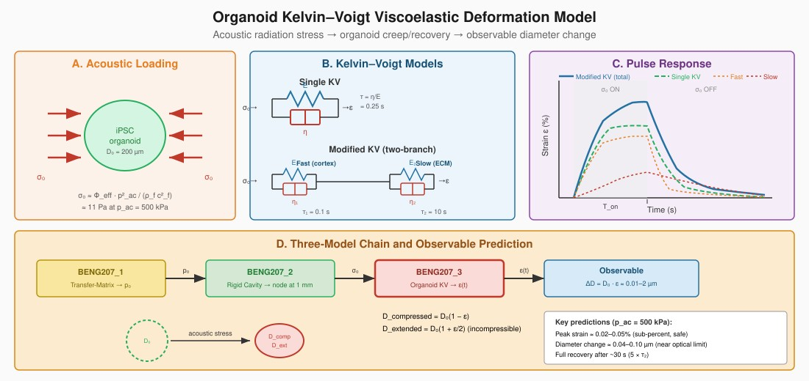

<pre>
Title: BENG207_Organoid_KV_Model
Author: BENG207 students (Instructor: Akihiro J. Matsuoka, M.D., D.M.Sc., Ph.D., FACS, Co-instructor: James Friend, Ph.D.)
Course: BENG207 Winter/Spring Semester (2026)
Status: Draft
Type: Analytical model
License: Public domain
Further discussion: TBD
</pre>

Instruction to BENG207 students: Please review all of the variables/parameters.
Please read GitHub upload instruction before you upload your code.

---

## Documentation

- [Student GitHub Workflow](GitHub_Upload_Instruction_BENG207.md)
- [Experimental protocol and plan](experimental_setup_guide.md)
- [Final Words 2/28/26](final_words.md)

## Table of Contents

* [Abstract](#abstract)
* [Background and Significance](#background-and-significance)
* [Deliverable](#deliverable)
* [BENG207 Organoid KV Model](#beng207-organoid-kv-model-analytical-model)
* [Parameters](#parameters)
* [Output Figures: Captions](#output-figures-captions)
* [References](#references)

---

## Abstract

TBW

## Background and Significance

### Why Model Organoid Deformation?

The BENG207_1 transfer-matrix model describes how acoustic energy enters the fluid channel through the vertical stack. The BENG207_2 rigid cavity resonator model describes how that energy is organized into a lateral standing wave with pressure nodes at ~1 mm spacing, where iPSC organoids form. However, neither model addresses what happens to the organoid *itself* once it is trapped at a pressure node.

An organoid sitting at a pressure node experiences a time-varying acoustic radiation stress. Unlike a rigid bead, the organoid is a soft, viscoelastic biological structure — it deforms under this stress. The deformation has practical consequences for the biohybrid cochlear implant:

* **Too much deformation** may disrupt cell-cell junctions, collapse internal lumens, or trigger mechanotransduction pathways that alter differentiation — potentially converting neural progenitors into unintended cell types.
* **Too little deformation** may indicate the acoustic field is not coupling efficiently to the organoid, or that the organoid has stiffened pathologically (e.g., fibrosis).
* **Residual (non-recovered) deformation** after repeated acoustic pulses may indicate permanent structural damage or plastic remodeling of the extracellular matrix (ECM).

This model provides the quantitative framework to predict organoid deformation as a function of acoustic parameters (pressure amplitude, pulse duration, duty cycle) and organoid mechanical properties (elastic modulus, viscosity, relaxation times). It answers the design question: **for a given acoustic protocol, how much does the organoid deform, and does it fully recover?**

### The Kelvin-Voigt Viscoelastic Framework

Biological tissues are viscoelastic — they exhibit both elastic (spring-like, instantaneous) and viscous (dashpot-like, time-dependent) behavior. The simplest model that captures both is the Kelvin-Voigt (KV) element: a spring (modulus E) in parallel with a dashpot (viscosity η). Under a step stress σ₀, the KV element produces a creep response:

$$
\varepsilon(t) = \frac{\sigma_0}{E}\left(1 - e^{-t/\tau}\right), \quad \tau = \frac{\eta}{E}
$$

where τ is the **relaxation time** — the characteristic timescale for the organoid to approach its equilibrium deformation. When the stress is removed, the strain recovers exponentially with the same time constant:

$$
\varepsilon(t) = \varepsilon_T \, e^{-(t-T)/\tau}
$$

where ε_T is the strain at the moment the stress was removed (t = T). This complete recovery is a defining feature of the KV model — it predicts **no permanent deformation**, only delayed elastic response.

### Single KV vs. Modified (Two-Branch) KV

A single KV element has one relaxation time τ. Real organoids, however, exhibit at least two distinct deformation timescales:

1. **Fast response (τ₁ ~ 0.1 s):** This reflects the deformation of individual cells — cortical actin, cell membrane bending, and cytoplasmic flow. When you poke a single cell with an AFM tip, it deforms within ~100 ms.
2. **Slow response (τ₂ ~ 10 s):** This reflects the rearrangement of cells relative to each other and the remodeling of the extracellular matrix. The organoid as a multicellular structure takes much longer to reach mechanical equilibrium than a single cell.

The modified KV model places two KV elements in series (technically, the stress is shared and strains add):

$$
\varepsilon(t) = \frac{\sigma_0}{E_1}\left(1 - e^{-t/\tau_1}\right) + \frac{\sigma_0}{E_2}\left(1 - e^{-t/\tau_2}\right)
$$

The fast branch (E₁ = 500 Pa, τ₁ = 0.1 s) captures the initial rapid deformation. The slow branch (E₂ = 30 Pa, τ₂ = 10 s) captures the continued creep that occurs over seconds to tens of seconds. The slow branch is softer (lower E₂) because intercellular rearrangement offers less resistance than intracellular deformation.

This two-timescale behavior has practical consequences for acoustic pulse design:

* **Short pulses (T_on < τ₁):** Only the fast branch responds. The organoid barely deforms.
* **Moderate pulses (τ₁ < T_on < τ₂):** The fast branch is fully loaded; the slow branch is partially loaded. Most of the deformation comes from the fast branch.
* **Long pulses (T_on > τ₂):** Both branches reach equilibrium. Maximum deformation occurs.

### Acoustic Stress Estimation

#### Part A — Single-Source Estimate (20 MHz reference)

The organoid at 20 MHz has D/λ ≈ 2.7 (diameter = 200 µm, λ ≈ 74 µm), so it is **not in the small-particle regime**. The Gor'kov point-particle theory (used in BENG207_2 for positioning) does not strictly apply for computing the deformation stress — the acoustic field varies across the organoid diameter. Instead, we estimate the effective uniaxial compressive stress from the acoustic radiation pressure:

$$
\sigma_0 \approx 2 \, \Phi_{\mathrm{eff}} \, E_{\mathrm{ac}} = \Phi_{\mathrm{eff}} \, \frac{p_{\mathrm{ac}}^2}{\rho_f \, c_f^2}
$$

where E_ac = p_ac²/(2ρ_f c_f²) is the acoustic energy density and Φ_eff ≈ 0.15 is an effective contrast/geometric factor. For p_ac = 500 kPa (a moderate SAW-driven pressure), this gives σ₀ ≈ 17.1 Pa. This is small compared to E₁ = 500 Pa, meaning the resulting strains are within the linear viscoelastic regime where the KV model is valid.

#### Part B — Gor'kov-Linked Dual-PZT Estimate (741 kHz, Config B)

At the actual operating frequency of 741 kHz (BENG207_2 Config B), D/λ ≈ 0.1 and the organoid is firmly in the **small-particle regime** where Gor'kov theory is rigorously valid. Config B uses two counter-propagating PZT-5A transducers immersed in water, producing a perfect standing wave:

$$
p(x,t) = (p_L + p_R)\cos(kx)\cos(\omega t)
$$

The pressure amplitudes superpose at the antinodes, giving p_total = p_L + p_R = 1000 kPa at 500 kPa per transducer. The Gor'kov radiation stress is then:

$$
\sigma_0^{\mathrm{dual}} = \Phi \cdot \frac{(p_L + p_R)^2}{\rho_f \, c_f^2}
$$

where Φ = 0.059 is the acoustic contrast factor derived from the organoid's compressibility and density contrast relative to water:

$$
\Phi = \frac{1}{3}f_1 - \frac{1}{2}f_2, \quad f_1 = 0.1282 \text{ (monopole)}, \quad f_2 = 0.0323 \text{ (dipole)}
$$

At 500 kPa per transducer this gives σ₀ = 26.8 Pa — **57% larger** than the Part A estimate. The increase comes from two effects: (1) the counter-propagating waves superpose at the node so the effective pressure doubles, and (2) Φ from Gor'kov theory replaces the hand-waved Φ_eff = 0.15, which nearly cancel — but the 4× energy from superposition dominates.

### Deformation Geometry: Uniaxial vs. Biaxial

The geometry of acoustic stress depends on the transducer configuration.

**Part A — Uniaxial (single source):** The standing wave propagates along one axis (x). The radiation stress squeezes the organoid primarily from one side. One transverse axis (y) is free to expand; the organoid deforms as a prolate ellipsoid. Under incompressibility (ν ≈ 0.5):

$$
D_x = D_0(1 - \varepsilon), \quad D_y = D_0\!\left(1 + \frac{\varepsilon}{2}\right)
$$

**Part B — Biaxial (dual PZT, Config B):** Two counter-propagating waves squeeze the organoid symmetrically from **both** ±x sides. Both transverse axes (y and z) are free to expand equally. The organoid flattens into a disk. Under incompressibility:

$$
D_x = D_0(1 - \varepsilon), \quad D_y = D_z = D_0(1 + \varepsilon)
$$

The axial compression D_x is identical in form for both cases — the difference is that σ₀ is larger in Part B, and the transverse expansion is larger (ε vs ε/2), meaning the organoid expands more strongly in the y and z directions. This has practical implications: organoid-to-organoid spacing in the depth direction (z) may change during acoustic exposure, and the increased transverse extension is more visible to an upright brightfield microscope imaging from above.

### Phase Control and Node Steering (Part B)

A key advantage of the dual-PZT configuration is **phase control**. Applying a phase offset φ between the two transducers shifts all pressure nodes simultaneously by:

$$
\Delta x = \frac{\phi}{2k} = \frac{\phi \, \lambda}{4\pi}
$$

At 741 kHz (λ = 2.0 mm), sweeping φ from 0 to π shifts nodes by λ/4 = 0.5 mm — exactly half the electrode spacing. This allows fine-tuning of organoid position relative to the CI electrode array without physically moving any hardware.

As the node shifts away from the organoid, the effective pressure at the original organoid location drops as cos(φ/2), and the radiation stress drops as cos²(φ/2):

$$
\sigma_0(\phi) = \sigma_0^{\max} \cos^2\!\left(\frac{\phi}{2}\right)
$$

At φ = π the organoid sits at a pressure node (zero acoustic force, zero deformation stress). This phase-dependent stress profile is computed in Fig 10.

### Relationship to BENG207_1 and BENG207_2

The three models form a complete chain:

1. **BENG207_1 (Transfer-Matrix):** Determines the acoustic pressure amplitude p₀ entering the fluid channel as a function of frequency and layer geometry. This sets the available acoustic energy.
2. **BENG207_2 (Rigid Cavity Resonator):** Determines where organoids form (pressure nodes at ~1 mm spacing) and the Gor'kov trapping force that holds them in place. Uses p₀ from BENG207_1.
3. **BENG207_3 (This model — Organoid KV):** Determines how much each organoid deforms under the acoustic radiation stress derived from p₀. Predicts whether the deformation is safe (reversible, sub-percent strain) or damaging (large strain, incomplete recovery).

The coupling between models is through the acoustic pressure: BENG207_1 → p₀ → BENG207_2 (lateral force) and BENG207_3 (deformation stress σ₀). If the transfer-matrix model predicts that couplant degradation reduces p₀ by 3 dB, both the trapping force (BENG207_2) and the organoid deformation (BENG207_3) drop by 50%.

In Part B (Config B), BENG207_1 is bypassed — PZT-5A transducers are immersed directly in water with no couplant gel, eliminating the BENG207_1 failure mode (couplant degradation). The pressure p_L and p_R entering the channel are set directly by transducer drive voltage.

### Pulse Train Response and Residual Strain

In practice, the acoustic field is not applied as a single continuous pulse but as a sequence of ON/OFF cycles (pulse train). This model computes the organoid strain under arbitrary pulse protocols using superposition of shifted single-pulse responses.

The key question is whether **residual strain accumulates** across pulses. For a single KV element, the answer is no — each pulse's strain fully decays before the next pulse (provided T_off > 5τ). For the two-branch modified KV, the slow branch (τ₂ = 10 s) may not fully recover between pulses if T_off is short (e.g., 2 s). This leads to a ratcheting effect where each successive pulse adds a small increment of persistent deformation. This is not permanent damage — the strain will eventually recover after the last pulse — but it means the organoid is continuously deformed during the acoustic protocol, which may affect cellular behavior. This effect is amplified in Part B because σ₀ is 57% larger.

### Experimental Validation

The model predictions are directly testable using existing technology:

* **Creep-recovery curves:** Apply a known acoustic pulse and image the organoid diameter change over time using high-speed brightfield microscopy. Fit the creep and recovery curves to extract E₁, η₁, E₂, η₂.
* **Pulse protocol dependence:** Compare short-pulse vs. long-pulse responses. The single KV model predicts a single exponential approach to equilibrium; the two-branch model predicts a distinct two-phase response with fast initial deformation followed by slow creep.
* **Acoustic pressure sweep:** Measure peak deformation vs. transducer voltage. The model predicts a linear relationship (strain ∝ σ₀ ∝ p_ac²) in the small-deformation regime.
* **Residual strain after pulse train:** Image the organoid after the last pulse in a train. The two-branch model predicts measurable residual strain if T_off < 5τ₂ ≈ 50 s.
* **Phase sweep (Part B):** Sweep φ from 0 to π and track organoid diameter as a function of phase offset. The model predicts a cos²(φ/2) decrease in deformation — this can be used to experimentally calibrate the actual node position relative to organoid position.
* **Uniaxial vs. biaxial signature (Part B):** In dual-PZT Config B, the transverse expansion (D_y) should be ~2× larger than in single-source Config A for equivalent σ₀, because both free axes expand. This geometric difference is measurable if the Basler camera images both axes.
* **PDMS attenuation measurement (Part B):** The model assumes α = 5 dB/cm/MHz for PDMS, but actual attenuation varies 3–12 dB/cm/MHz depending on cure ratio, temperature, and age. This must be measured after fabricating the thinned walls to confirm T_power and determine whether further wall thinning is needed. The near-term method requires no hydrophone: run one PZT into water only (no PDMS wall) and measure bead node density or standing wave contrast as a field proxy, then insert the PDMS wall and repeat. The ratio gives T_power directly (see Protocol H in the experimental setup guide). For absolute pressure calibration, a calibrated hydrophone is required — see the Instrumentation note below.

Predicted diameter changes at p_ac = 500 kPa per transducer (dual PZT) are on the order of 0.1–1 µm depending on pulse duration. At higher pressures (p_ac = 2 MPa), diameter changes approach several µm and become clearly resolvable with standard brightfield microscopy.

### Instrumentation Note: Pressure Measurement at 741 kHz

Standard needle hydrophones from Onda (HNA, HNP, HNR series) have factory calibration starting at 1 MHz — just above the 741 kHz operating frequency. The same lower bound applies to most commercial needle probes. Three options exist for this lab:

**Near-term (no purchase needed):** Use the Basler camera + polystyrene beads as a substitution detector. Compare bead node density or organoid deformation with and without the PDMS wall at matched drive voltage. This gives T_power to within ~10–15% and is sufficient for deciding whether to thin the walls further. This is the recommended first step before any hardware purchase.

**Long-term (recommended purchase):** Precision Acoustics 1 mm or 2 mm PVDF needle hydrophone (HP1 or HP2 series), calibrated by NPL London from 30 kHz to 40 MHz — covers 741 kHz with margin. A complete system requires the probe, submersible preamplifier, and DC coupler (~£3,000–4,500 total). Contact Precision Acoustics at acoustics.co.uk for a quote. This becomes essential for absolute σ₀ calibration independent of the model (Protocol D drag balance in the experimental setup guide).

**Alternative (US vendor):** Onda HNC-0400 or HNP-0400 with a custom extended low-frequency calibration requested at time of order (~$2,000–3,500 probe + AH-2010 preamplifier). Call Onda (Sunnyvale, CA) directly to confirm sub-1 MHz calibration availability before ordering.

---

## Deliverable

### Part A — Single-Source Uniaxial Model (Figs 1–7)

We compute the viscoelastic deformation ε(t) of a 200 µm iPSC organoid under pulsed acoustic loading, using both single and two-branch Kelvin-Voigt models with the original Φ_eff = 0.15 stress estimator. We characterize:

1. Single-pulse creep and recovery response for both models.
2. Pulse train strain accumulation for repeated ON/OFF cycles.
3. Peak deformation as a function of pulse duration (10 ms to 10 s).
4. Parameter sensitivity: how E₁, E₂, τ₁, τ₂ affect peak and residual strain.
5. Pulse protocol comparison: short, long, and burst protocols.
6. Diameter change prediction: conversion from strain to observable µm change (uniaxial geometry).
7. Acoustic pressure sweep: peak deformation vs. p_ac from 10 kPa to 3 MPa.

### Part B — Dual-PZT Config B Biaxial Model (Figs 8–10)

Using the Gor'kov-linked stress estimator and biaxial geometry appropriate for Config B (two PZT-5A transducers, counter-propagating, 741 kHz, 20 mm channel, ~20 organoids at 1 mm spacing), we characterize:

8. Stress comparison: old Φ_eff = 0.15 uniaxial estimate vs. Gor'kov dual-PZT estimate across full pressure range (10 kPa – 3 MPa). Demonstrates the 57% stress increase from superposition.
9. Biaxial deformation: single pulse (Fig 9a) and pulse train (Fig 9b) comparing uniaxial (Part A) and biaxial (Part B) deformation. Shows D_x compression and D_y/D_z extension separately, with disk-geometry diameter conversion.
10. Phase sweep: stress σ₀(φ) and peak strain ε_peak(φ) as the phase offset φ sweeps from 0 to π (node shift 0 to λ/4 = 0.5 mm), for all 20 organoids in the channel.

---

## BENG207 Organoid KV Model (Analytical Model)

### Single Kelvin-Voigt Element

The constitutive equation is:

$$
\sigma(t) = E \, \varepsilon(t) + \eta \, \dot{\varepsilon}(t)
$$

For a step stress σ₀ applied at t = 0 and removed at t = T:

$$
\varepsilon(t) = \begin{cases}
\frac{\sigma_0}{E}\left(1 - e^{-t/\tau}\right) & 0 \leq t < T \\
\varepsilon(T) \, e^{-(t-T)/\tau} & t \geq T
\end{cases}
$$

where τ = η/E is the relaxation time.

### Modified KV (Two-Branch)

Two KV elements in series (strains add, stress shared equally):

$$
\varepsilon(t) = \frac{\sigma_0}{E_1}\left(1 - e^{-t/\tau_1}\right) + \frac{\sigma_0}{E_2}\left(1 - e^{-t/\tau_2}\right)
$$

where τ₁ = η₁/E₁ (fast, cortex/cell) and τ₂ = η₂/E₂ (slow, ECM/intercellular).

### Pulse Train (Superposition)

For N pulses with period T_on + T_off, the total strain is the superposition of shifted single-pulse responses:

$$
\varepsilon_{\mathrm{total}}(t) = \sum_{n=0}^{N-1} \varepsilon_{\mathrm{pulse}}\left(t - n(T_{\mathrm{on}} + T_{\mathrm{off}})\right)
$$

where each ε_pulse is the single-pulse response (creep during ON, recovery during OFF).

### Acoustic Stress

**Part A (single source, 20 MHz reference):**

$$
\sigma_0 \approx \Phi_{\mathrm{eff}} \, \frac{p_{\mathrm{ac}}^2}{\rho_f \, c_f^2}, \quad \Phi_{\mathrm{eff}} \approx 0.15
$$

**Part B (dual PZT Config B, 741 kHz, Gor'kov):**

$$
\sigma_0^{\mathrm{dual}} = \Phi \cdot \frac{(p_L + p_R)^2}{\rho_f \, c_f^2}, \quad \Phi = 0.059
$$

$$
\Phi = \frac{1}{3}f_1 - \frac{1}{2}f_2, \quad f_1 = 1 - \frac{\rho_f c_f^2}{\rho_p c_p^2} = 0.1282, \quad f_2 = \frac{2(\rho_p - \rho_f)}{2\rho_p + \rho_f} = 0.0323
$$

**Phase-dependent stress (Part B):**

$$
\sigma_0(\phi) = \sigma_0^{\max} \cos^2\!\left(\frac{\phi}{2}\right)
$$

### Diameter Change

**Part A — Uniaxial:**

$$
D_x = D_0(1 - \varepsilon), \quad D_y = D_0\!\left(1 + \frac{\varepsilon}{2}\right)
$$

One transverse axis extends by ε/2 to conserve volume (prolate ellipsoid).

**Part B — Biaxial:**

$$
D_x = D_0(1 - \varepsilon), \quad D_y = D_z = D_0(1 + \varepsilon)
$$

Both free transverse axes extend equally by ε (organoid flattens into a disk). Volume conservation: (1−ε)(1+ε)² ≈ 1 to first order in ε.

### Figure

If you want to modify this figure, a vector version can be found in docs/img.

**Figure 1: Schematic overview of the BENG207_3 organoid Kelvin–Voigt viscoelastic deformation model.**

**(A) Acoustic Loading.** A 200 µm diameter iPSC-derived organoid (green ellipse) sits at a pressure node of the lateral standing wave established by the rigid cavity resonator (BENG207_2). The acoustic radiation stress σ₀ acts as a compressive load along the wave propagation axis. In Part A (single source), the load is uniaxial; in Part B (dual PZT Config B), counter-propagating waves from both sides produce symmetric biaxial compression. The stress magnitude is estimated from the acoustic energy density. For Part A: σ₀ ≈ Φ_eff · p_ac²/(ρ_f c_f²) with Φ_eff ≈ 0.15, giving σ₀ ≈ 17.1 Pa at 500 kPa. For Part B (Gor'kov, 741 kHz): σ₀ = Φ · (p_L + p_R)²/(ρ_f c_f²) with Φ = 0.059, giving σ₀ ≈ 26.8 Pa at 500 kPa per transducer — 57% larger due to wave superposition at the antinode.

**(B) Kelvin–Voigt Models.** *Top:* The single KV element consists of a spring (elastic modulus E = 200 Pa) in parallel with a dashpot (viscosity η = 50 Pa·s), giving a single relaxation time τ = η/E = 0.25 s. Under a step stress σ₀, the strain rises as:

$$
\varepsilon(t) = \frac{\sigma_0}{E}\left(1 - e^{-t/\tau}\right)
$$

and recovers fully upon stress removal. This model captures the gross creep-recovery behavior but cannot distinguish between intracellular and intercellular deformation timescales. *Bottom:* The modified two-branch KV model places two KV elements in series (strains additive). The fast branch (E₁ = 500 Pa, η₁ = 50 Pa·s, τ₁ = 0.1 s) represents the rapid deformation of individual cells — cortical actin remodeling, cell membrane bending, and cytoplasmic flow. The slow branch (E₂ = 30 Pa, η₂ = 300 Pa·s, τ₂ = 10 s) represents the gradual rearrangement of cells relative to each other and the remodeling of the extracellular matrix (ECM). The slow branch is softer (lower E₂) because intercellular rearrangement encounters less elastic resistance than intracellular deformation but involves much higher effective viscosity due to cell–cell adhesion and ECM drag.

**(C) Pulse Response.** Representative creep-recovery curves for a single acoustic pulse (gray shaded region = stress ON). The solid blue curve shows the total strain from the modified two-branch KV model; the dashed green curve shows the single KV response. During the ON phase, the modified KV initially deforms rapidly (orange dotted curve, fast branch saturating within ~0.5 s) then continues to creep slowly (red dotted curve, slow branch still rising at T_on). After stress removal, the fast branch recovers within ~0.5 s, but the slow branch retains measurable strain for ~30 s (5 × τ₂). This two-phase recovery is the key experimentally distinguishable signature of the two-branch model — a single KV element cannot produce this behavior.

**(D) Three-Model Chain and Observable Prediction.** The three BENG207 models form a sequential chain that links transducer design to a measurable biological outcome.

**BENG207_1** (Transfer-Matrix Model, yellow box) computes the acoustic pressure amplitude p₀ transmitted through the vertical multilayer stack (LiNbO₃ → ultrasound gel couplant → borosilicate glass → water) as a function of frequency and layer geometry. This pressure p₀ is the energy available for both lateral trapping and organoid deformation. *Note: In Part B Config B, PZT-5A transducers are immersed directly in water — BENG207_1 is bypassed and couplant degradation is eliminated.*

**BENG207_2** (Rigid Cavity Resonator, green box) takes p₀ and computes the lateral standing wave, determining the pressure node positions at λ/2 ≈ 1 mm spacing where organoids form. It also provides the Gor'kov radiation force (Φ ≈ 0.059 for cells in water) that holds each organoid at its node.

**BENG207_3** (Organoid KV Model, red box, this model) takes σ₀ and computes the time-dependent viscoelastic strain ε(t) using the single or two-branch KV constitutive equations, for arbitrary pulse protocols. The output strain is converted to an experimentally observable diameter change using uniaxial (Part A) or biaxial (Part B) geometry. At 500 kPa per transducer (dual PZT), key predictions are:

- Peak strain ≈ 9.7% (modified KV, 500 ms pulse, biaxial) — within the linear regime
- D_x compressed by ~19.4 µm; D_y extended by ~19.4 µm (disk geometry)
- Full strain recovery within ~30 s after last pulse (5 × τ₂)

---

## Parameters

### Part A Parameters

**Organoid geometry:**

* Diameter: D₀ = 200 µm (radius R = 100 µm)
* Density: ρ_p ≈ 1050 kg/m³

**Acoustic loading (Part A):**

* Carrier frequency: f₀ = 20 MHz (for D/λ calculation)
* D/λ = 2.70 (not small-particle — Gor'kov not valid)
* Acoustic pressure: p_ac = 500 kPa (moderate, sweepable 10 kPa – 3 MPa)
* Effective contrast factor: Φ_eff = 0.15
* Estimated σ₀ at 500 kPa: 17.1 Pa

**Fluid:**

* Water: ρ_f = 1000 kg/m³, c_f = 1483 m/s, µ_f = 1 mPa·s

**Single KV element:**

* E = 200 Pa (soft organoid — literature range 100–1000 Pa for iPSC-derived neural organoids)
* η = 50 Pa·s
* τ = η/E = 0.25 s

**Modified KV — fast branch (cortex / single-cell deformation):**

* E₁ = 500 Pa
* η₁ = 50 Pa·s
* τ₁ = η₁/E₁ = 0.1 s

**Modified KV — slow branch (ECM / intercellular rearrangement):**

* E₂ = 30 Pa
* η₂ = 300 Pa·s
* τ₂ = η₂/E₂ = 10 s

**Pulse protocols (default):**

* Single pulse: T_on = 500 ms, observation window 5 s
* Pulse train: T_on = 500 ms, T_off = 2 s, 10 pulses
* Protocol comparison: short (100 ms ON/2 s OFF × 5), long (2 s ON/10 s OFF × 3), burst (50 ms ON/200 ms OFF × 20)

### Part B Parameters

**Acoustic loading (Part B — dual PZT Config B):**

* Operating frequency: f₀_B = 741 kHz
* Wavelength in water: λ = c_f / f₀_B = 2.001 mm
* D/λ = 0.0999 (small-particle — Gor'kov theory valid)
* p_L = p_R = 500 kPa per transducer (symmetric; sweepable independently)
* Effective pressure at antinode: p_total = p_L + p_R = 1000 kPa

**Gor'kov contrast factor:**

* f₁ = 0.1282 (monopole — compressibility contrast)
* f₂ = 0.0323 (dipole — density contrast)
* Φ = (1/3)f₁ − (1/2)f₂ = 0.059
* Compare: Φ_polystyrene ≈ 0.22 (beads are ~4× easier to trap than organoids)

**Organoid acoustic properties:**

* ρ_p = 1050 kg/m³, c_p = 1550 m/s

**Stress at 500 kPa per transducer:**

* σ₀_dual = Φ · (p_L + p_R)² / (ρ_f c_f²) = 26.83 Pa
* Ratio vs Part A: 26.83 / 17.05 = 1.573 (57% larger)

**PDMS wall attenuation (model assumption vs. measured):**

* Model assumes: α = 5 dB/cm/MHz (Carugo et al. 2012, literature midpoint)
* Actual range: 3–12 dB/cm/MHz (varies with PDMS base:crosslinker ratio, cure temperature, age)
* T_power at 3 mm wall (5 dB/cm/MHz): 0.77 (77% force retained) — model value
* **Must measure after fabrication** — use substitution method (bead contrast with/without wall) before committing to wall thickness. See Instrumentation Note above and Protocol H in the experimental setup guide.
* If measured α > 8 dB/cm/MHz: thin walls further to 1–2 mm, or switch to a lower base:crosslinker ratio (e.g., 20:1 instead of 10:1) for lower attenuation.

**Channel geometry:**

* Channel length: L = 20 mm
* Node spacing: λ/2 = 1.001 mm
* Number of organoids: N ≈ 20

**Phase sweep:**

* φ range: 0 to π (0° to 180°)
* Node shift at φ = π: λ/4 = 0.500 mm
* σ₀(φ) = σ₀_max · cos²(φ/2)

---

## Output Figures: Captions

### Part A — Single-Source Uniaxial (Figs 1–7)

* **Fig 1** (`org_fig1_single_pulse.csv`) — Single pulse response — strain (%) vs. time for single KV and two-branch modified KV under a 500 ms acoustic pulse (σ₀ = 17.1 Pa). Shows the fast branch reaching equilibrium within ~0.5 s while the slow branch continues to creep. After pulse removal, the fast branch recovers quickly while the slow branch retains strain for ~30 s.

* **Fig 2** (`org_fig2_pulse_train.csv`) — Pulse train accumulation — strain (%) vs. time for 10 repeated pulses (500 ms ON, 2 s OFF). The single KV shows identical peak strain on each pulse. The modified KV shows increasing baseline strain due to incomplete slow-branch recovery between pulses — the ratcheting effect.

* **Fig 3** (`org_fig3_peak_vs_duration.csv`) — Peak strain vs. pulse duration — peak deformation at end of pulse as a function of T_on from 10 ms to 10 s. Shows that pulses shorter than τ₁ (0.1 s) produce minimal deformation, pulses between τ₁ and τ₂ load only the fast branch, and pulses longer than τ₂ (10 s) approach full equilibrium deformation.

* **Fig 4** (`org_fig4_sensitivity.csv`) — Parameter sensitivity — peak strain and residual strain as a function of E₁, E₂, τ₁, τ₂ (varied one at a time). Shows which parameters most strongly affect organoid deformation and recovery. Identifies the most important measurements needed for model calibration.

* **Fig 5** (`org_fig5_protocols.csv`) — Pulse protocol comparison — strain response for three protocols (short 100 ms, long 2 s, burst 50 ms). Shows how different pulse durations and duty cycles affect the balance between fast and slow branch loading, and how to design protocols that preferentially test each timescale.

* **Fig 6** (`org_fig6_diameter.csv`) — Diameter change prediction — converts strain to observable diameter change (µm) for both compressed (D_x) and extended (D_y) axes, using uniaxial geometry (D_y = D₀(1 + ε/2)). Shows the experimental measurement target at 500 kPa.

* **Fig 7** (`org_fig7_stress_sweep.csv`) — Stress sweep — peak deformation (%) and diameter change (µm) vs. acoustic pressure from 10 kPa to 3 MPa for both single and modified KV. Shows the quadratic dependence (strain ∝ p²) and identifies the pressure regime where deformation becomes optically measurable.

### Part B — Dual-PZT Config B Biaxial (Figs 8–10)

* **Fig 8** (`org_fig8_stress_comparison.csv`) — Stress estimator comparison — σ₀ vs. p_ac (10 kPa – 3 MPa) for both the old Φ_eff = 0.15 uniaxial estimate (Part A) and the Gor'kov dual-PZT estimate (Part B). Also shows the ratio (constant at ~1.573 across all pressures) and the corresponding peak strain and diameter change for each estimate. Demonstrates that the Gor'kov correction and wave superposition together increase the effective stress by 57% over the original hand-waved estimate.

* **Fig 9a** (`org_fig9a_biaxial_single_pulse.csv`) — Biaxial single pulse deformation — strain (%) and diameter change (µm) vs. time for a 500 ms pulse, comparing uniaxial (Part A, σ₀ = 17.1 Pa) and biaxial (Part B, σ₀ = 26.8 Pa) models side by side. Outputs D_x (compressed, acoustic axis) and D_y (extended, free transverse axis) for both configurations. Highlights the two differences: (1) larger strain in Part B due to higher σ₀, and (2) larger transverse extension in Part B (ε vs ε/2).

* **Fig 9b** (`org_fig9b_biaxial_pulse_train.csv`) — Biaxial pulse train — strain (%) and diameter changes (µm) vs. time for 10 repeated pulses (500 ms ON, 2 s OFF), comparing uniaxial vs. biaxial. Shows amplified ratcheting in Part B due to the larger σ₀. Both D_x and D_y columns output for experimental comparison.

* **Fig 10** (`org_fig10_phase_sweep.csv`) — Phase sweep — σ₀(φ), peak strain ε_peak(φ), and biaxial diameters (D_x, D_y) as the transducer phase offset φ sweeps from 0° to 180°. Node shifts from 0 to λ/4 = 0.5 mm. Stress follows cos²(φ/2): maximum at φ = 0° (organoid on-node), 50% at φ = 90° (node shifted 0.25 mm), zero at φ = 180° (organoid at pressure null). This figure is the theoretical basis for experimental calibration of node position using deformation as a readout.

---

## References

* Bruus, H. (2012). Acoustofluidics 7: The acoustic radiation force on small particles. *Lab on a Chip*, 12, 1014–1021.

* Efremov, Y. M., Wang, W. H., Hardy, S. D., Geahlen, R. L., & Raman, A. (2017). Measuring nanoscale viscoelastic parameters of cells directly from AFM force-displacement curves. *Scientific Reports*, 7, 1541.

* Guimarães, C. F., Gasperini, L., Marques, A. P., & Reis, R. L. (2020). The stiffness of living tissues and its implications for tissue engineering. *Nature Reviews Materials*, 5, 351–370.

* Gor'kov, L. P. (1962). On the forces acting on a small particle in an acoustical field in an ideal fluid. *Soviet Physics Doklady*, 6, 773–775.

* Hou, Z. et al. (2020). Deformable oscillation by parametric bulk acoustic wave. *Extreme Mechanics Letters*, 37, 100716.

* Prevedel, R., Diz-Muñoz, A., Ruocco, G., & Antonacci, G. (2019). Brillouin microscopy: an emerging tool for mechanobiology. *Nature Methods*, 16, 969–977.

* Carugo, D. et al. (2012). Acoustic attenuation in PDMS membranes for microfluidic applications. *Biomicrofluidics*, 6, 024119.
